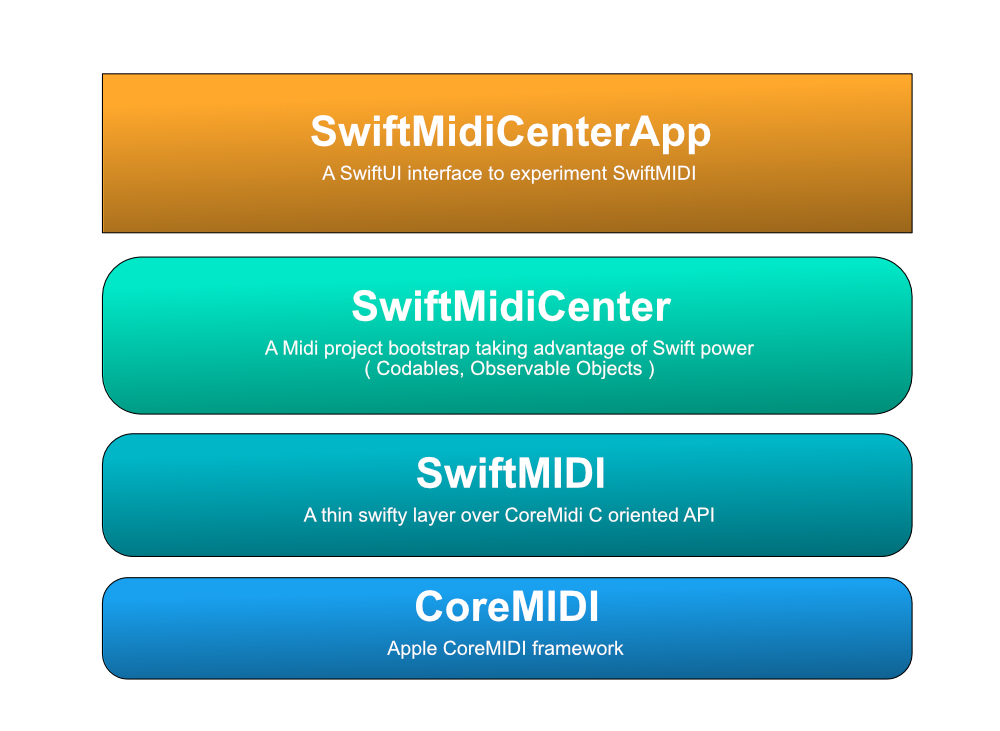

# SwiftMIDI

**SwiftMIDI** adds a swifty syntaxic sugar to make **CoreMidi** a bit less bitter.

The main purpose of this framework is to 

- Replace calls returning OSStatus by throwing function
- Replace UnsafeMutablePointer output parameters by classic function results
- Few syntax changes in function names

```swift
func findMidiThruConnections(owner: String) throws -> [MIDIThruConnectionRef]?
```

instead of 

```swift
func MIDIThruConnectionFind(_ inPersistentOwnerID: CFString, _ outConnectionList: UnsafeMutablePointer<Unmanaged<CFData>>) -> OSStatus
```

**SwiftMIDI** is a simple framework that does only wrap principal CoreMIDI functions, and add few logic and definitions for common midi operations.

[https://github.com/moosefactory/SwiftMIDI]()

The **SwiftMIDICenter** framework adding some more system oriented features like storage and configurations management.

[https://github.com/moosefactory/SwiftMIDICenter]()

You can see both working in a sample project developed in SwiftUI : **SwiftMidiCenter App**

[https://github.com/moosefactory/MIDICenterApp]()



## <font color='#1E72AD'>Installation</font>

**SwiftMIDI** is distributed as a Swift Package

## <font color='#1E72AD'>Author</font>

Tristan Leblanc <tristan@moosefactory.eu>

**MooseFactory Software**

***

## <font color='#1E72AD'>License</font>

SwiftMIDI is available under the MIT license. See the [LICENSE](LICENSE) file for more info.

***


## <font color='#1E72AD'>History</font>

First Commit:
v1.0.0 : 2021-01-01 at Midnight, Paris Time. Happy New Year :)
